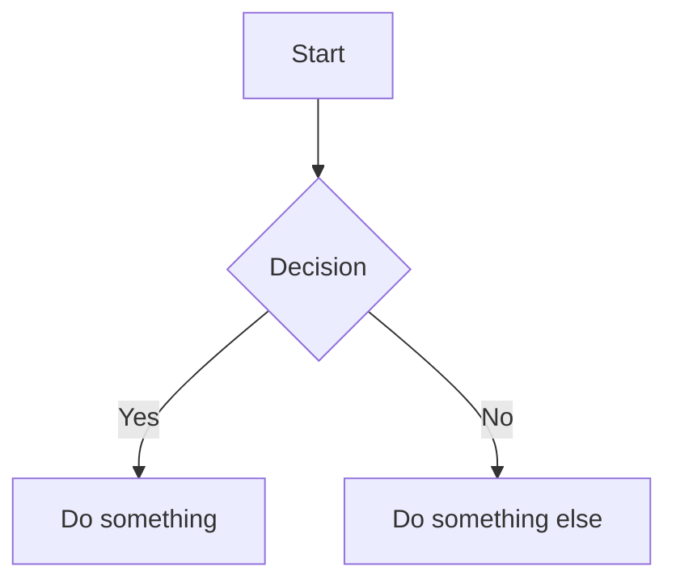

The file editor includes a live markdown preview for `.md` files, rendering GitHub Flavored Markdown with syntax-highlighted code blocks and Mermaid diagrams.



## How It Works

When you open a markdown file in the [File Editor](), a preview toggle becomes available. The preview renders your markdown in real time as you edit, using the same rendering pipeline as GitHub.

## Supported Features

- **GitHub Flavored Markdown** — Tables, task lists, strikethrough, autolinks
- **Syntax Highlighting** — Fenced code blocks with language-specific highlighting via Highlight.js
- **Mermaid Diagrams** — Flowcharts, sequence diagrams, Gantt charts, class diagrams, and more
- **Line Breaks** — Newlines are preserved without requiring double-space or `<br>`

## Mermaid Diagrams

Wrap diagram definitions in a `mermaid` fenced code block:

````markdown

````

Diagrams render inline with a dark theme. Supported diagram types include flowcharts, sequence diagrams, Gantt charts, class diagrams, state diagrams, and more.
